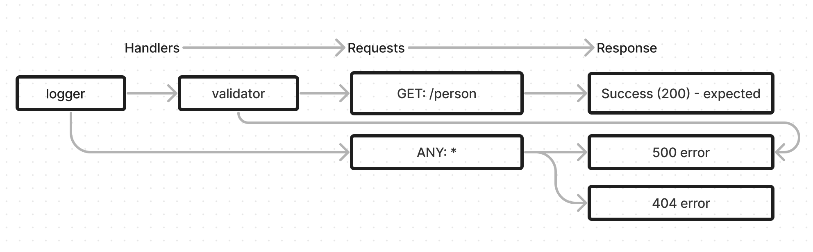

# LAB - Class 02

## Project: Basic Express Server

### Author: Jelani Rhinehart

### Problem Domain  

Basic Express server with tests.

### Links and Resources

- [GitHub Actions ci/cd](https://github.com/rkgallaway/server-deployment-practice-d51/actions)
- [back-end server url](http://xyz.com) (when applicable)

### Setup

#### `.env` requirements

PORT:enter-whatever-port-you-want

#### How to initialize/run your application

- `nodemon` (if installed) OR
- `npm start`

#### Features / Routes

- GET : `/person` - specific route to hit

#### Tests

- How do you run tests?
`npm test`
- Any tests of note?
Test to run logger middleware

Error handling tests

Test to make sure validator is running correctly

#### UML

